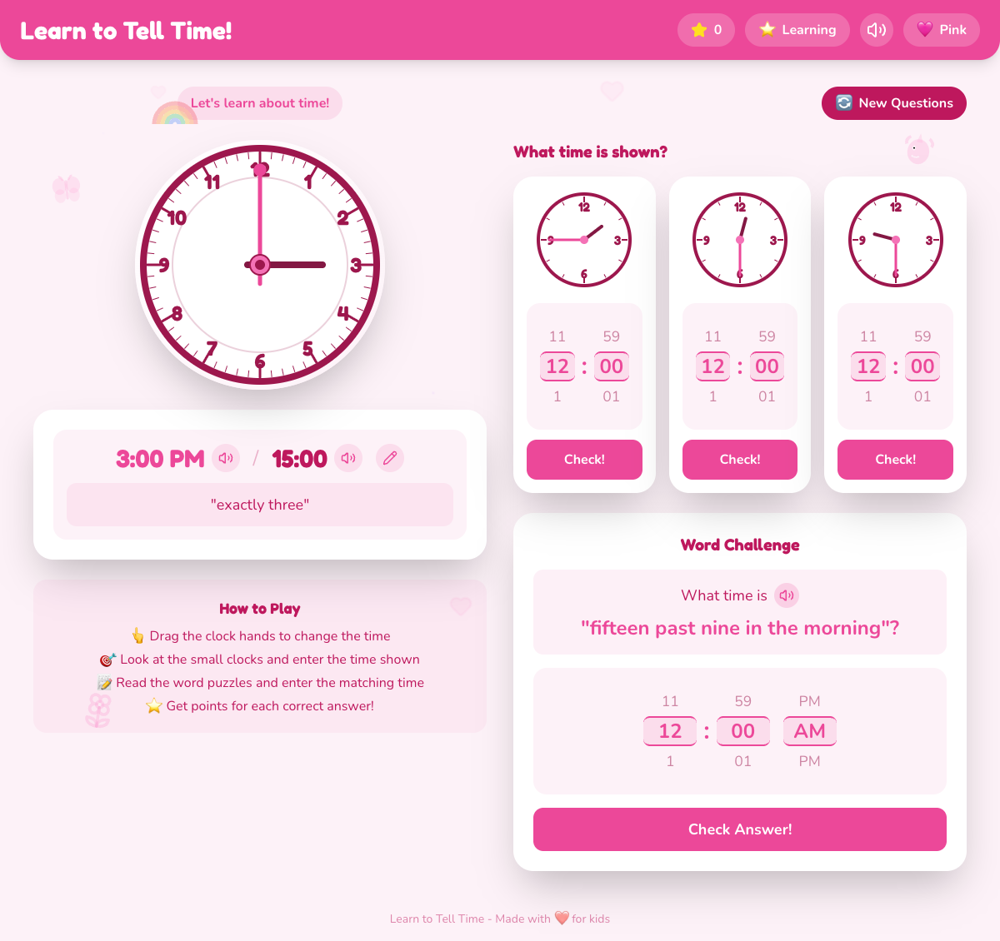

# Clock Learning Game - Project Plan

A web-based interactive clock game designed to help children aged 6-8 learn to tell time.



## Table of Contents

- [Learning Objectives](#learning-objectives)
- [Target Audience](#target-audience)
- [Technology Stack](#technology-stack)
- [UI Layout Design](#ui-layout-design)
- [Features](#features)
  - [Main Interactive Clock](#1-main-interactive-clock)
  - [Digital Time Display](#2-digital-time-display)
  - [Time in Words Display](#3-time-in-words-display)
  - [Quiz Section - Small Clocks](#4-quiz-section---small-clocks)
  - [Word Problems Section](#5-word-problems-section)
  - [Difficulty Levels](#6-difficulty-levels)
  - [Theme Toggle](#7-theme-toggle)
  - [Sound Effects](#8-sound-effects)
  - [Score and Progress](#9-score-and-progress)
- [Responsive Design](#responsive-design)
- [Testing Strategy](#testing-strategy)
- [Project Structure](#project-structure)
- [Future Enhancements](#future-enhancements)

---

## Learning Objectives

1. **Reading analog clocks** - Understanding hour and minute hands
2. **Understanding time relationships** - How minute hand movement affects hour hand
3. **12-hour and 24-hour formats** - Both digital representations
4. **English time expressions** - "half past", "quarter to", etc.

---

## Target Audience

- **Age Range**: 6-8 years old
- **Skill Level**: Learning to tell time, familiar with numbers 1-60
- **Focus Areas**:
  - O'clock times (3:00, 7:00)
  - Half past times (3:30, 7:30)
  - Quarter past/to times (3:15, 3:45)
  - 5-minute increments for advanced learners

---

## Technology Stack

| Category | Choice | Reason |
|----------|--------|--------|
| **Framework** | React + Vite | Fast, great ecosystem, easy component reuse |
| **Language** | TypeScript | Type safety, better IDE support |
| **Styling** | Tailwind CSS | Rapid styling, easy theming |
| **UI Components** | Framer Motion | Smooth animations for kid engagement |
| **State Management** | Zustand | Simple, lightweight |
| **Testing** | Vitest + React Testing Library | Fast, Vite-native |
| **E2E Testing** | Playwright | Reliable cross-browser testing |
| **Sound Effects** | Howler.js | Easy audio playback |
| **Confetti** | canvas-confetti | Celebration effects |
| **Icons** | Lucide React | Clean, customizable icons |
| **Wheel Picker** | Custom component | Apple-style scroll wheel input |
| **Text-to-Speech** | Web Speech API | Native browser speech synthesis |
| **Deployment** | GitHub Pages | Free, easy CI/CD integration |

---

## UI Layout Design

```
┌────────────────────────────────────────────────────────────────────┐
│  Learn to Tell Time!                       [Blue] [Pink]           │
├────────────────────────────────────────────────────────────────────┤
│                                                                    │
│   ┌─────────────────────────┐      ┌──────────────────────────┐   │
│   │                         │      │  Score: 5 points          │   │
│   │      MAIN CLOCK         │      ├──────────────────────────┤   │
│   │    (Interactive)        │      │  Quiz Clocks:            │   │
│   │      300x300px          │      │  ┌────┐ ┌────┐ ┌────┐   │   │
│   │                         │      │  │    │ │    │ │    │   │   │
│   │   [drag hands here]     │      │  └────┘ └────┘ └────┘   │   │
│   │                         │      │  [picker][picker][picker]│   │
│   └─────────────────────────┘      │  [Check] [Check] [Check] │   │
│                                     │                          │   │
│   ┌─────────────────────────┐      ├──────────────────────────┤   │
│   │  Digital: 3:30 PM       │      │  Word Challenge:         │   │
│   │  24-hour: 15:30         │      │  "What is half past 8?"  │   │
│   │  [Wheel Picker Input]   │      │  [picker] [Check Answer] │   │
│   └─────────────────────────┘      │                          │   │
│                                     └──────────────────────────┘   │
│   ┌─────────────────────────┐                                      │
│   │  "This is half past     │      [New Questions]                 │
│   │   three!"               │      [Difficulty: Easy]              │
│   └─────────────────────────┘                                      │
└────────────────────────────────────────────────────────────────────┘
```

---

## Features

### 1. Main Interactive Clock

- Large analog clock (responsive, ~300px on desktop)
- Clear numbers 1-12 around the face
- **Hour hand**: Shorter, thicker, different color
- **Minute hand**: Longer, thinner
- **Center dot**: Decorative center piece
- **Drag behavior**:
  - Dragging minute hand → hour hand moves proportionally (every 12 minutes = 1 hour mark)
  - Dragging hour hand → minute hand stays put
- Visual feedback when dragging (hand highlights, subtle glow)
- Touch-friendly for tablet/mobile use

### 2. Digital Time Display

- Shows current clock time in:
  - 12-hour format with AM/PM (e.g., "3:30 PM")
  - 24-hour format (e.g., "15:30")
- **Wheel Picker Input**: Apple-style scrolling wheel picker
  - Hour wheel: 1-12 (loops continuously)
  - Minute wheel: 00-59 (loops continuously)
  - AM/PM wheel: toggles between options
- Changing digital time updates the analog clock hands instantly

### 3. Time in Words Display

- Shows the English expression for current time
- Kid-friendly, clear text
- Examples:

| Time | Expression |
|------|------------|
| 3:00 | "three o'clock" |
| 3:15 | "quarter past three" |
| 3:30 | "half past three" |
| 3:45 | "quarter to four" |
| 3:05 | "five past three" |
| 3:10 | "ten past three" |
| 3:20 | "twenty past three" |
| 3:25 | "twenty-five past three" |
| 3:35 | "twenty-five to four" |
| 3:40 | "twenty to four" |
| 3:50 | "ten to four" |
| 3:55 | "five to four" |

### 4. Quiz Section - Small Clocks

- 3 small static analog clocks showing random times
- Times generated based on current difficulty level
- Below each clock: wheel picker for answer input
- "Check" button for each clock
- Visual feedback:
  - **Correct**: Green glow + confetti animation + celebration sound
  - **Incorrect**: Red shake animation + encouraging "try again" message
- Points awarded for correct answers (+1 each)
- After correct answer, clock can show new random time

### 5. Word Problems Section

- Shows time in words, child enters digital time using wheel picker
- Questions generated based on difficulty level
- Examples:
  - "What time is quarter past nine?" → Answer: 9:15
  - "What time is half past two?" → Answer: 2:30
  - "What time is ten to seven?" → Answer: 6:50
  - "What time is eight o'clock?" → Answer: 8:00
- Same feedback system as quiz clocks
- Encourages reading and understanding time expressions

### 6. Difficulty Levels

| Level | Description | Times Included |
|-------|-------------|----------------|
| **⭐ Easy** | O'clock times only | 1:00, 2:00, 3:00, etc. |
| **⭐ Learning** | O'clock + half past + quarters | X:00, X:15, X:30, X:45 |
| **⭐ Expert** | Any 5-minute increment | X:00, X:05, X:10, X:15, etc. |

- Default: **Learning** (appropriate for 6-8 age range)
- Kid-friendly labels with star icons in the UI

### 7. Theme Toggle

#### Blue Theme
- **Background**: Light sky blue with subtle clouds
- **Clock face**: White/light blue with navy blue numbers
- **Hands**: Dark blue hour hand, lighter blue minute hand
- **Decorations**:
  - Rockets
  - Dinosaurs
  - Cars
  - Sports balls
  - Stars
- **Accent colors**: Navy blue, turquoise

#### Pink Theme
- **Background**: Light pink with subtle sparkles
- **Clock face**: White/light pink with purple numbers
- **Hands**: Purple hour hand, pink minute hand
- **Decorations**:
  - Butterflies
  - Flowers
  - Unicorns
  - Hearts
  - Rainbows
- **Accent colors**: Purple, magenta, coral

### 8. Sound Effects & Speech

| Event | Sound |
|-------|-------|
| Moving clock hands | Soft tick |
| Correct answer | Celebration chime/fanfare |
| Incorrect answer | Gentle encouraging tone |
| Button clicks | Soft pop |
| New questions | Whoosh |

**Text-to-Speech Features:**
- Speaker buttons next to time displays
- Reads current time aloud in natural language
- Reads word problems aloud for accessibility
- Uses Web Speech API (no external dependencies)

- **Mute button**: Clearly visible for quiet play
- **Default**: Sounds ON (engaging for kids)
- Sounds should be pleasant and not startling

### 9. Score and Progress

- **Points counter**: Displayed prominently at top
- **Streak counter**: Consecutive correct answers
- **Encouraging messages**:
  - "Great job!"
  - "You're getting good at this!"
  - "Keep going!"
- **"New Questions" button**: Refreshes quiz clocks and word problems
- Session-based (resets on page refresh)

---

## Responsive Design

| Screen Size | Layout |
|-------------|--------|
| **Desktop (1024px+)** | Side-by-side layout (main clock left, quiz right) |
| **Tablet (768px-1023px)** | Stacked layout, larger touch targets |
| **Mobile (<768px)** | Single column, tab navigation between sections |

### Touch Considerations
- Minimum touch target: 44x44px
- Clock hands have larger invisible hit areas for easier grabbing
- Wheel pickers work smoothly with touch

---

## Testing Strategy

### Unit Tests
- Time calculation functions (angle to time, time to angle)
- Time-to-words conversion
- Words-to-time conversion
- Quiz time generation
- Score calculation

### Component Tests
- Clock rendering with correct hand positions
- Hand dragging behavior
- Wheel picker input and output
- Theme switching
- Score updates

### E2E Tests
- Complete quiz flow (answer question, get feedback, earn points)
- Drag clock hands and verify digital display updates
- Change digital time and verify analog clock updates
- Theme toggle persistence
- Mobile/touch interactions

---

## Project Structure

```
clock-game/
├── .github/
│   └── workflows/
│       ├── ci.yml              # Test on PR/push
│       └── deploy.yml          # Build & deploy to GitHub Pages
├── docs/
│   ├── plan.md                 # This document
│   └── screenshot.png          # App screenshot
├── src/
│   ├── components/
│   │   ├── Clock/
│   │   │   ├── AnalogClock.tsx      # Main interactive clock
│   │   │   ├── ClockHand.tsx        # Draggable hand component
│   │   │   ├── ClockFace.tsx        # Clock face with numbers
│   │   │   ├── MiniClock.tsx        # Small quiz clock
│   │   │   └── index.ts             # Barrel export
│   │   ├── DigitalDisplay/
│   │   │   ├── DigitalTime.tsx      # Time display with speech
│   │   │   ├── WheelPicker.tsx      # Custom Apple-style picker
│   │   │   ├── TimeInput.tsx        # Combined time input
│   │   │   ├── TimeDisplayInput.tsx # Display with edit capability
│   │   │   └── index.ts             # Barrel export
│   │   ├── Quiz/
│   │   │   ├── ClockQuiz.tsx        # Quiz section container
│   │   │   ├── WordProblem.tsx      # Word challenge component
│   │   │   ├── QuizCard.tsx         # Individual quiz card
│   │   │   └── index.ts             # Barrel export
│   │   ├── Layout/
│   │   │   ├── Header.tsx           # App header with controls
│   │   │   ├── ThemeToggle.tsx      # Blue/Pink toggle
│   │   │   ├── ScoreDisplay.tsx     # Points display
│   │   │   ├── DifficultySelector.tsx
│   │   │   └── index.ts             # Barrel export
│   │   ├── Feedback/
│   │   │   ├── EncouragingMessage.tsx # Feedback messages
│   │   │   └── index.ts             # Barrel export
│   │   └── Decorations/
│   │       ├── BlueThemeDecorations.tsx
│   │       ├── PinkThemeDecorations.tsx
│   │       ├── CustomIcons.tsx      # Theme-specific icons
│   │       └── index.ts             # Barrel export
│   ├── hooks/
│   │   ├── useClockDrag.ts          # Clock hand dragging logic
│   │   ├── useQuiz.ts               # Quiz state management
│   │   ├── useSound.ts              # Sound effect handling
│   │   ├── useSpeech.ts             # Text-to-speech hook
│   │   └── useTime.ts               # Time state and conversions
│   ├── utils/
│   │   ├── timeConversion.ts        # Angle ↔ time conversions
│   │   ├── timeToWords.ts           # Convert time to English
│   │   └── generateQuizTime.ts      # Random time generation
│   ├── stores/
│   │   ├── gameStore.ts             # Score, difficulty state
│   │   └── themeStore.ts            # Theme preference
│   ├── themes/
│   │   ├── blue.ts                  # Blue theme config
│   │   ├── pink.ts                  # Pink theme config
│   │   └── index.ts                 # Theme provider
│   ├── types/
│   │   └── index.ts                 # TypeScript types
│   ├── App.tsx                      # Main app component
│   ├── main.tsx                     # Entry point
│   └── index.css                    # Global styles + Tailwind
├── tests/
│   └── e2e/                         # Playwright E2E tests
├── public/
│   ├── clock-icon.svg              # App icon
│   └── CNAME                       # Custom domain config
├── package.json
├── vite.config.ts
├── tsconfig.json
├── playwright.config.ts
├── TODO.md                          # Task tracking
└── README.md                        # Project documentation
```

---

## Future Enhancements

These features are out of scope for the initial release but could be added later:

1. **Tutorial Mode**: First-time walkthrough with animated hints showing how to use the app
2. **Character Guide**: Friendly animal mascot (owl, clock-themed character) that gives encouragement
3. **Achievement Badges**: Collectible badges like "Time Master!", "Perfect Score!", "10 in a Row!"
4. **Parent Dashboard**: Lock difficulty settings, view progress over time, set time limits
5. **Multiple Languages**: Support for different languages and time expression formats
6. **Offline Support**: PWA functionality for use without internet
7. **Custom Themes**: Let kids choose their own colors
8. **Multiplayer Mode**: Race against friends or siblings
9. **Additional Quiz Types**:
   - "Show me 3:30" - set the clock to match
   - Duration questions - "What time is 2 hours after 3:00?"
10. **Accessibility Improvements**:
    - Screen reader support
    - Keyboard-only navigation
    - High contrast mode
